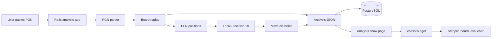
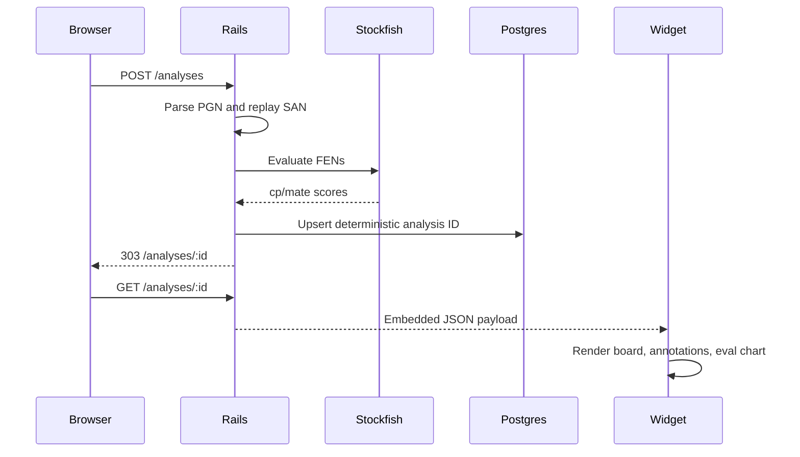

# Chess Analysis Widget

Rails chess analysis service with an embeddable `<chess-widget>`.

## Project

`analysis-app/` — Rails app that parses PGN, replays boards, calls Stockfish 18, stores analyses in PostgreSQL, and renders analysis pages. The widget lives in `analysis-app/public/` and is served statically.

## System Overview





## Setup

Prerequisites:

- Ruby through mise (`mise use ruby@latest` is already captured in `.mise.toml`)
- Bun
- PostgreSQL running locally
- `curl` and `tar`

```sh
bin/setup
```

`bin/setup` copies `.env.example` to `.env` when missing, installs Bun and Ruby dependencies, downloads Stockfish 18 into `analysis-app/vendor/stockfish/`, and runs Rails database preparation. Rails loads the monorepo `.env` directly, so the scripts do not export shell variables.

## Configuration

Local configuration lives in `.env` and is not committed. Start with:

```sh
cp .env.example .env
```

Important variables:

- `POSTGRES_HOST`, `POSTGRES_DB`, `POSTGRES_TEST_DB`, `POSTGRES_USER`, `POSTGRES_PASSWORD`
- `STOCKFISH_PATH`, `STOCKFISH_DEPTH`, `STOCKFISH_TIMEOUT`
- `HOST`, `PORT`

## Development

```sh
bin/run    # prepare DB and start Rails locally
bin/lint   # Ruby syntax, StandardRB when available, Cucumber, ESLint, Prettier
bin/fix    # StandardRB --fix when available, ESLint --fix, Prettier write
```

Open:

```text
http://localhost:3000          # PGN form
http://localhost:3000/about    # widget demo
http://localhost:3000/analyses # saved analyses
```

Docker is not used for local development. Use local Ruby, Bun, PostgreSQL, and Stockfish.

## Production Container

Docker is reserved for the production container path. `analysis-app/Dockerfile` builds the Rails app image and installs Stockfish from Debian packages, avoiding GitHub downloads during image builds. `docker-compose.yml` exists only to test that Dockerfile locally with PostgreSQL:

```sh
docker compose up --build analysis-app
```

For real production, run the Dockerfile-built image with managed PostgreSQL and replace `SECRET_KEY_BASE` and database credentials in the deployment environment.

## Testing

```sh
bin/lint
```

High-level Cucumber specs live in `features/`. The host Ruby must be 3.x to run StandardRB and Cucumber locally.

## Notes

- The widget reads precomputed analysis JSON from the DOM and makes no API calls.
- Analyses are keyed by a deterministic SHA-256 prefix of the PGN input.
- If Stockfish is unavailable, the service falls back to material evaluation and marks the result as approximate.
