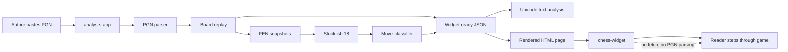
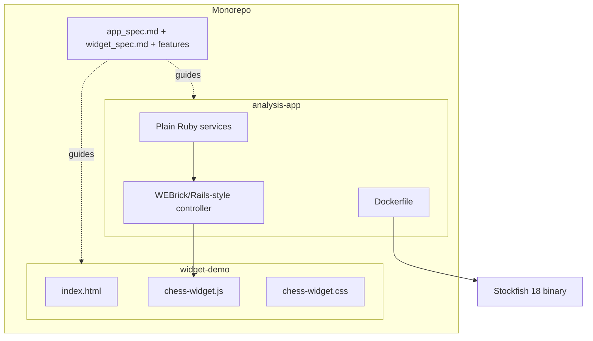
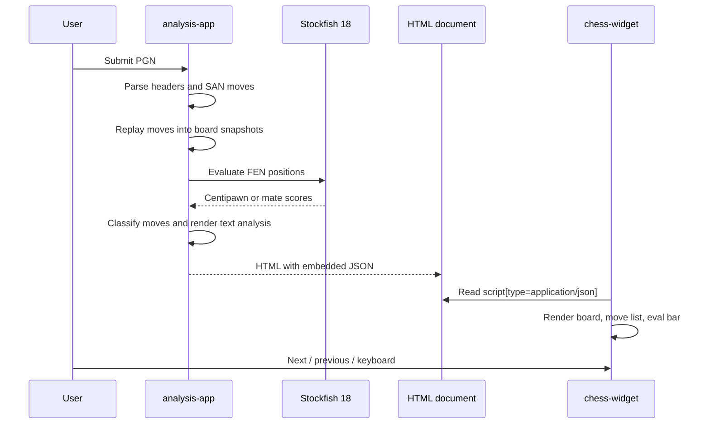

# Chess Analysis Widget

Monorepo for a small chess analysis proof of concept.

## Projects

- `analysis-app/` - Rails-style Ruby app responsible for PGN parsing, board replay, Stockfish integration, move annotations, text analysis, and widget payload generation.
- `widget-demo/` - static no-build demo for `<chess-widget>`, using embedded analyzed JSON only.

## System Overview

The important split is ownership: the server is allowed to understand chess, call
Stockfish, and prepare complete positions. The widget is intentionally boring: it
renders precomputed state and never asks the network for more data.







## Run With Docker

The Docker image downloads the official Stockfish 18 Linux x86-64 AVX2 release
asset and exposes it at `/usr/local/bin/stockfish`.

```sh
docker compose up --build analysis-app
```

Open:

```text
http://localhost:3000
```

The compose service uses `platform: linux/amd64` so the Stockfish 18 binary works
consistently, including on Apple Silicon through Docker emulation.

## Testing

```sh
docker compose run --rm analysis-app ruby script/check_sample
docker compose run --rm analysis-app ruby -c app/services/chess/stockfish_analyzer.rb
node --check widget-demo/chess-widget.js
```

High-level Cucumber specs live in `features/`. They document the intended
behavior but do not yet have step definitions:

```text
features/analysis_app.feature
features/widget.feature
```

Without Docker, the Ruby app still runs with a material-evaluation fallback if
`stockfish` is not installed locally.

## Architecture

The server is the analysis layer. It receives PGN, produces board snapshots, invented or Stockfish-backed evaluations, annotations, a text analysis, and a widget-ready JSON payload.

The widget is the presentation layer. It makes no API calls and does not parse PGN or run chess analysis.
